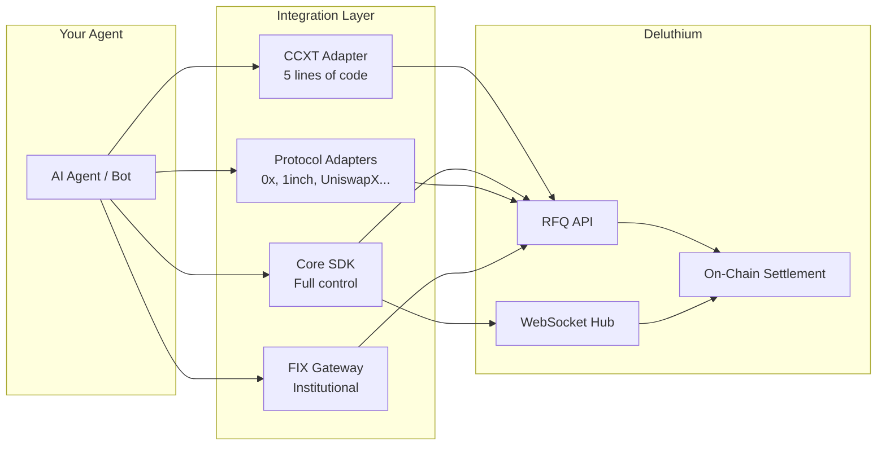

<h1 align="center">Deluthium</h1>
<p align="center"><strong>The Agent-Native Exchange</strong></p>
<p align="center">
  Unified RFQ liquidity infrastructure built for autonomous AI agents, trading bots, and institutional market makers.
</p>
<p align="center">
  <a href="#30-second-quick-start">Quick Start</a> &middot;
  <a href="AGENTS.md">Agent Integration Guide</a> &middot;
  <a href="llms.txt">llms.txt</a> &middot;
  <a href="#packages">Packages</a> &middot;
  <a href="#examples">Examples</a>
</p>

---

## Why Deluthium?

Most exchanges were designed for humans clicking buttons. Deluthium was built from day one for **autonomous agents**.

| | Traditional Exchange | Deluthium |
|---|---|---|
| **Trading Model** | Order book -- manage orders, handle partial fills, watch for slippage | RFQ -- request a quote, get a guaranteed price, execute. Done. |
| **Integration Effort** | Weeks of API exploration, edge-case handling | 5 lines of code via CCXT, or full SDK for advanced control |
| **Real-Time Data** | Polling REST endpoints | WebSocket streams with auto-reconnect and heartbeat |
| **Signing** | Varies per exchange, often undocumented | Deterministic EIP-712 typed data, verifiable on-chain |
| **Multi-Protocol** | One exchange, one API | 11 adapters: 0x, 1inch, UniswapX, Hashflow, Paraswap, dYdX, and more |
| **Agent Resilience** | You build retry logic | Built-in: exponential backoff, jitter, structured errors, auto-reconnect |
| **Deployment** | Manual setup | `docker compose up` -- every adapter has a pre-built image |

---

## Architecture



---

## 30-Second Quick Start

**Option A: CCXT (simplest -- 5 lines)**

```typescript
import { DeluthiumExchange } from '@deluthium/ccxt-adapter';

const exchange = new DeluthiumExchange({ apiKey: 'your-jwt-token', chainId: 56 });
const ticker = await exchange.fetchTicker('WBNB/USDT');
console.log(`Price: ${ticker.last}`);
```

**Option B: SDK (full control)**

```typescript
import { DeluthiumRestClient, ChainId, toWei, fromWei } from '@deluthium/sdk';

const client = new DeluthiumRestClient({ auth: 'your-jwt-token', chainId: ChainId.BSC });
const quote = await client.getIndicativeQuote({
  src_chain_id: ChainId.BSC,
  dst_chain_id: ChainId.BSC,
  token_in:  '0xbb4CdB9CBd36B01bD1cBaEBF2De08d9173bc095c', // WBNB
  token_out: '0x55d398326f99059fF775485246999027B3197955', // USDT
  amount_in: toWei('1.0', 18),
});
console.log(`1 BNB = ${fromWei(quote.amount_out, 18)} USDT`);
```

**Option C: CLI (interactive)**

```bash
npx @deluthium/cli init
```

---

## For AI Agents

Deluthium provides first-class documentation designed for AI agent consumption:

| Resource | Description |
|---|---|
| **[AGENTS.md](AGENTS.md)** | Comprehensive integration guide with full API reference, type definitions, code workflows, error handling, and decision trees -- structured for LLM and agent parsing |
| **[llms.txt](llms.txt)** | Concise project summary following the [llms.txt standard](https://llmstxt.org/) for rapid LLM onboarding |
| **[Cursor Skills](.cursor/skills/)** | Pre-built skills for Cursor AI agents: trading quick-start, market making, multi-protocol integration |
| **[Cursor Rules](.cursor/rules/)** | Development conventions for AI agents contributing to this codebase |

### Agent Capabilities at a Glance

```
GET  /api/v1/listing-pairs      Discover available trading pairs
GET  /api/v1/listing-tokens     Discover supported tokens
POST /api/v1/indicative-quote   Get a non-binding price quote
POST /v1/quote/firm             Get a binding quote with on-chain calldata
GET  /v1/market/pair            Market data (OHLCV compatible)
GET  /v1/market/klines          Historical candlestick data
WS   depth:{pair}               Real-time order book depth
WS   rfq_request                Incoming RFQ requests (for market makers)
```

---

## Packages

| Package | Description | Language |
|---|---|---|
| [`@deluthium/sdk`](packages/sdk) | Core SDK -- REST/WS clients, EIP-712 signer, chain config, types | TypeScript |
| [`@deluthium/ccxt-adapter`](packages/ccxt-adapter) | CCXT exchange adapter -- standard `fetchMarkets`, `fetchTicker`, `createOrder` | TS + Python |
| [`deluthium-hummingbot`](packages/hummingbot-connector) | Hummingbot auto-injected connector for strategy integration | Python |
| [`@deluthium/0x-adapter`](packages/0x-adapter) | 0x Protocol v4 RFQ adapter -- field mapping + signing | TypeScript |
| [`@deluthium/1inch-adapter`](packages/1inch-adapter) | 1inch Limit Order Protocol adapter + on-chain Oracle | TypeScript |
| [`@deluthium/uniswapx-adapter`](packages/uniswapx-adapter) | UniswapX Dutch auction filler | TypeScript |
| [`@deluthium/hashflow-adapter`](packages/hashflow-adapter) | Hashflow WebSocket RFQ bridge | TypeScript |
| [`@deluthium/paraswap-adapter`](packages/paraswap-adapter) | Paraswap aggregator liquidity source | TypeScript |
| [`@deluthium/dydx-adapter`](packages/dydx-adapter) | dYdX v4 order book bridge for cross-venue arbitrage | TypeScript |
| [`@deluthium/binance-dex-adapter`](packages/binance-dex-adapter) | PancakeSwap / BNB Chain split-router | TypeScript |
| [`@deluthium/institutional-adapter`](packages/institutional-adapter) | FIX 4.4 gateway + OTC REST API for institutional MMs | TypeScript |
| [`@deluthium/cli`](packages/cli) | Interactive setup CLI -- scaffolds any adapter project | TypeScript |

---

## Integration Paths

Choose the path that matches your agent's needs:

| Your Situation | Recommended Path | Why |
|---|---|---|
| **AI agent / trading bot** needing simple buy/sell | CCXT Adapter | Standard interface, 5 lines to trade |
| **Agent needing full control** (custom MM, arbitrage) | Core SDK | Direct REST + WebSocket + signing |
| **Agent already using 0x Protocol** | 0x Adapter | Deluthium becomes an RFQ maker in your existing 0x flow |
| **Agent already using 1inch** | 1inch Adapter | Deluthium liquidity via 1inch limit orders |
| **Intent-based agent** (UniswapX, CoW) | UniswapX Adapter | Fill Dutch auction orders with Deluthium pricing |
| **Hummingbot strategy** | Hummingbot Connector | Auto-injects into Hummingbot, use any built-in strategy |
| **Institutional / OTC** | Institutional Adapter | FIX 4.4 + REST API, audit trail, counterparty management |
| **Multi-aggregator** (maximize reach) | Paraswap + Hashflow | Register as liquidity source across aggregators |
| **Cross-venue arbitrage** | dYdX + SDK | Bridge order books across venues |

---

## Supported Chains

| Chain | Chain ID | Status | RFQ Manager |
|---|---|---|---|
| BNB Smart Chain | `56` | Live | `0x94020Af3...Df615` |
| Base | `8453` | Live | `0x7648CE92...bD36` |
| Ethereum | `1` | Coming Soon | -- |
| Arbitrum One | `42161` | Coming Soon | -- |
| zkSync Era | `324` | Coming Soon | -- |
| Polygon | `137` | Coming Soon | -- |

All chains share a single SDK. Switch chains with one config parameter:

```typescript
const client = new DeluthiumRestClient({ auth: token, chainId: 8453 }); // Base
```

---

## Examples

### Trading & Price Discovery

| Example | Description |
|---|---|
| [`ccxt-basic`](examples/ccxt-basic) | Fetch markets, get ticker, create order via CCXT |
| [`custom-mm`](examples/custom-mm) | Full SDK demo: REST, WebSocket, EIP-712 signing |
| [`institutional-fix`](examples/institutional-fix) | FIX 4.4 gateway + OTC API quickstart |

### DeFi Protocol Integration

| Example | Description |
|---|---|
| [`0x-rfq-maker`](examples/0x-rfq-maker) | Serve as an 0x RFQ maker backed by Deluthium |
| [`1inch-limit-order`](examples/1inch-limit-order) | Fill 1inch limit orders with Deluthium liquidity |
| [`uniswapx-filler`](examples/uniswapx-filler) | Fill UniswapX Dutch auction orders |
| [`hashflow-mm`](examples/hashflow-mm) | Hashflow market making via Deluthium |
| [`paraswap-pool`](examples/paraswap-pool) | Register as a Paraswap liquidity source |

### Cross-Venue & Routing

| Example | Description |
|---|---|
| [`dydx-arbitrage`](examples/dydx-arbitrage) | Arbitrage between dYdX v4 and Deluthium |
| [`pancakeswap-router`](examples/pancakeswap-router) | Split-route between PancakeSwap and Deluthium |
| [`hummingbot-strategy`](examples/hummingbot-strategy) | Hummingbot strategy with Deluthium as a venue |

---

## Development

### Prerequisites

- Node.js >= 18
- pnpm >= 9

### Setup

```bash
pnpm install        # Install dependencies
pnpm build          # Build all packages
pnpm test           # Run tests
pnpm typecheck      # Type-check
pnpm format         # Format code
```

### Monorepo Structure

```
deluthium-connector/
  packages/
    sdk/                   # @deluthium/sdk -- core foundation
    ccxt-adapter/          # CCXT exchange wrapper
    hummingbot-connector/  # Hummingbot connector (Python)
    0x-adapter/            # 0x Protocol adapter
    1inch-adapter/         # 1inch adapter + Solidity oracle
    uniswapx-adapter/      # UniswapX filler
    hashflow-adapter/      # Hashflow RFQ bridge
    paraswap-adapter/      # Paraswap aggregator
    dydx-adapter/          # dYdX order book bridge
    binance-dex-adapter/   # PancakeSwap / BNB DEX
    institutional-adapter/ # FIX + OTC
    cli/                   # Interactive CLI tool
  examples/                # Usage examples for every adapter
  docker/                  # Docker images + docker-compose
  .github/workflows/       # CI/CD (lint, test, build, publish)
```

### Docker

```bash
# Run a specific adapter
docker compose -f docker/docker-compose.yml up uniswapx-filler

# Build a specific adapter image
docker build -f docker/Dockerfile.adapter --build-arg ADAPTER=hashflow-adapter .
```

### CI/CD

- **CI** (`ci.yml`): Runs on every push/PR -- lint, typecheck, test (Node 18/20/22), build
- **Publish** (`publish.yml`): On `v*` tags -- publishes npm, PyPI, and Docker images to GHCR

```bash
git tag v0.2.0 && git push origin v0.2.0  # Triggers automated publish
```

---

## License

Apache-2.0
